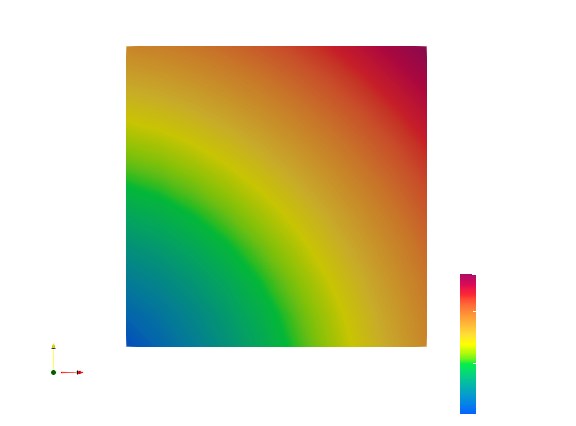
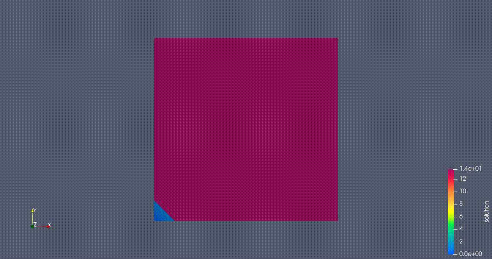
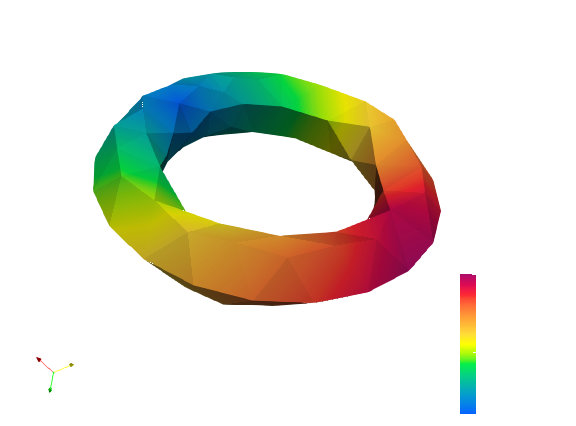
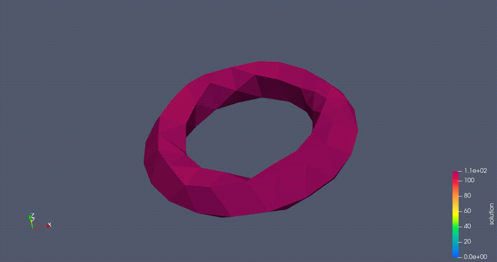

# Eikonal
Eikonal handson. Starting point provided by Prof. Formaggia Luca.

&nbsp;
| Student |
|-------- |
| [Capodanno Mario](https://github.com/MarioCapodanno) |
| [Grillo Valerio](https://github.com/Valegrl) |
| [Lovino Emanuele](https://github.com/EmanueleLovino) |
| [Noventa Nicola](https://github.com/NicoNovi9) |
| [Severino Emanuele](https://github.com/EmaSeve) |

## Introduction
An Eikonal equation is a non-linear first-order partial differential equation 
that is encountered in problems of wave propagation. <br>

An Eikonal equation is one of the form:

$$\begin{cases} 
H(x, \nabla u(x)) = 1 & \quad x \in \Omega \subset \mathbb{R}^d \\  
u(x) = g(x) & \quad x \in \Gamma \subset \partial\Omega 
\end{cases} $$

where 
- $d$ is the dimension of the problem, either 2 or 3;
- $u$ is the eikonal function, representing the travel time of a wave;
- $\nabla u(x)$ is the gradient of $u$, a vector that points in the direction of the wavefront;
- $H$ is the Hamiltonian, which is a function of the spatial coordinates $x$ and the gradient $\nabla u$;
- $\Gamma$ is a set smooth boundary conditions.

In most cases, 
$$H(x, \nabla u(x)) = |\nabla u(x)|_{M} = \sqrt{(\nabla u(x))^{T} M(x) \nabla u(x)}$$
where $M(x)$ is a symmetric positive definite function encoding the speed information on $\Omega$. <br> 
In the simplest cases, $M(x) = c^2 I$ therefore the equation becomes:

$$\begin{cases}
|\nabla u(x)| = \frac{1}{c} & \quad x \in \Omega \\  
u(x) = g(x) & \quad x \in \Gamma \subset \partial\Omega
\end{cases}$$

where $c$ represents the celerity of the wave.


# EikonalSolver

## Overview

EikonalSolver is a C++ project that solves the Eikonal equation using various methods. The project includes both serial and parallel solvers, and it can handle 2D and 3D meshes.

## Prerequisites

- CMake 3.10 or higher
- A C++17 compatible compiler
- Eigen3 library

## Building the Project

1. **Clone the repository:**

    ```sh
    git clone https://github.com/AMSC-24-25/21-eikonal-21-eikonal.git
    cd EikonalSolver
    ```

2. **Create a build directory:**

    ```sh
    mkdir build
    cd build
    ```

3. **Configure the project with CMake:**

    ```sh
    cmake ..
    ```

4. **Build the project:**

    ```sh
    make
    ```

## Running the Project

1. **Navigate to the build directory:**

    ```sh
    cd build
    ```

2. **Run the executable:**

    ```sh
    ./main
    ```

## Project Structure

- **include/**: Contains header files for the project.
- **src/**: Contains the main source files for the project.
- **LocalProblem/**: Contains source files for solving local Eikonal problems.
- **build/**: Directory for build files and executables.
- **tests/**: Contains test files and meshes.

## Example Usage

The project includes example meshes located in the  directory. The main executable will load a mesh, solve the Eikonal equation, and output the results to a VTK file.

## Results
After extensive testing, we have been able to conclude that the output from the serial solver is correct as well as the
parallel solver. The parallel solver has shown excellent scaling properties. <br>

The following are some examples visualized using Paraview:
<figure>
    
    <figcaption>2D square with one wave source.</figcaption>
</figure>



<figure>
    
    <figcaption>3D square with one wave source.</figcaption>
</figure>




<br>


